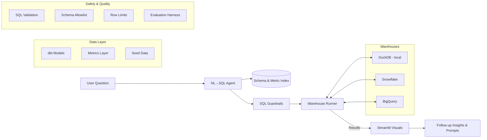

# Agentic Self-Service BI Assistant

A powerful natural language to SQL business intelligence platform that enables business users to ask questions in plain English and get instant insights with rich visualizations.

## 🎯 Overview

Business users can ask questions like "Show me attrition trends for Q2 in North America vs EMEA" and the system will:

1. **Translate** natural language to SQL using schema-aware LLM agents
2. **Execute** queries safely on Snowflake, BigQuery, or local DuckDB
3. **Visualize** results with automatic chart type selection
4. **Generate** follow-up insights and suggested next questions

## 🏗️ Architecture



## 🚀 Quick Start

### Prerequisites

- Python 3.9+
- Git

### Local Setup (DuckDB)

```bash
# Clone the repository
git clone <repository-url>
cd bi-assistant

# Create virtual environment
python -m venv .venv
source .venv/bin/activate  # On Windows: .venv\Scripts\activate

# Install dependencies
pip install -r requirements.txt

# Copy environment template
cp .env.example .env

# Bootstrap local database with sample data
python scripts/bootstrap_duckdb.py

# Start the application
streamlit run app/streamlit_app.py
```

The application will be available at `http://localhost:8501`

### Docker Setup (Optional)

```bash
# Start local services (Ollama + ChromaDB)
docker-compose --profile local up -d

# Or run the full application
docker-compose --profile app up --build
```

## 📊 Warehouse Configuration

### DuckDB (Local Development)

Default configuration for local development. No additional setup required.

```env
WAREHOUSE=DUCKDB
DUCKDB_PATH=.data/local.duckdb
```

### Snowflake

1. **Set up Snowflake objects:**
   ```sql
   -- Run sql/ddl/snowflake.sql in your Snowflake environment
   ```

2. **Configure environment:**
   ```env
   WAREHOUSE=SNOWFLAKE
   SNOWFLAKE_ACCOUNT=your_account
   SNOWFLAKE_USER=your_username
   SNOWFLAKE_PASSWORD=your_password
   SNOWFLAKE_WAREHOUSE=your_warehouse
   SNOWFLAKE_DATABASE=BI_ASSISTANT
   SNOWFLAKE_SCHEMA=MARTS
   SNOWFLAKE_ROLE=your_role
   ```

3. **Load sample data:**
   ```bash
   python scripts/load_to_snowflake.py
   ```

### BigQuery

1. **Set up BigQuery datasets:**
   ```sql
   -- Run sql/ddl/bigquery.sql (update PROJECT_ID)
   ```

2. **Configure environment:**
   ```env
   WAREHOUSE=BIGQUERY
   BQ_PROJECT_ID=your_project_id
   BQ_DATASET=bi_assistant
   GOOGLE_APPLICATION_CREDENTIALS=./.gcp/service-account.json
   ```

3. **Load sample data:**
   ```bash
   python scripts/load_to_bigquery.py
   ```

## 🔧 dbt Development

The project includes a complete dbt setup with dimensional models and metrics.

### Setup dbt Profile

```bash
# Copy template
cp dbt/profiles_template.yml ~/.dbt/profiles.yml

# Edit with your warehouse credentials
vim ~/.dbt/profiles.yml
```

### Run dbt Transformations

```bash
cd dbt

# Install dependencies
dbt deps

# Load seed data
dbt seed

# Run models
dbt run

# Run tests
dbt test

# Generate documentation
dbt docs generate
dbt docs serve
```

### Data Models

- **Seeds**: Raw HR data (employees, regions, attrition events)
- **Staging**: Cleaned and standardized data
- **Marts**: Business-ready dimensional models
  - `dim_employees`: Employee dimension with enriched attributes
  - `fct_attrition_events`: Attrition fact table with tenure calculations

### Metrics Layer

Defined in `dbt/models/marts/people/metrics.yml`:

- **attrition_rate**: Employee departure percentage
- **headcount**: Active employee count
- **hires**: New employee additions
- **terminations**: Employee departures
- **avg_tenure**: Average length of service
- **retention_rate**: Employee retention percentage

## 🤖 LLM Configuration

### Ollama (Local)

```bash
# Install Ollama
curl -fsSL https://ollama.ai/install.sh | sh

# Pull recommended model
ollama pull llama3.1

# Configure environment
echo "LLM_PROVIDER=ollama" >> .env
echo "OLLAMA_MODEL=llama3.1" >> .env
```

### OpenAI

```env
LLM_PROVIDER=openai
OPENAI_API_KEY=your_api_key
```

## 🛡️ Safety & Guardrails

The system includes comprehensive SQL safety measures:

- **Keyword Blocking**: Prevents DDL/DML operations (DROP, DELETE, UPDATE, etc.)
- **Schema Allowlist**: Only allows access to approved schemas
- **Row Limits**: Enforces maximum result set sizes
- **SQL Parsing**: Validates query structure before execution
- **Function Blocking**: Prevents dangerous functions (LOAD_FILE, etc.)

### Allowed Schemas
- `marts.people.*` - Business-ready analytics tables
- `staging.*` - Cleaned source data  
- `seeds.*` - Reference data

## 📈 Usage Examples

### Natural Language Queries

```
"Show me attrition trends for Q2 in North America vs EMEA"
"What's the current headcount by department?"
"Which regions have the highest hiring activity this quarter?"
"Show attrition rate by tenure groups for the last 12 months"
"What's the average salary by department and gender?"
```

### Generated SQL Examples

```sql
-- Attrition trends by region and quarter
SELECT 
    r.region_name,
    DATE_TRUNC('month', ae.termination_date) as month,
    COUNT(*) as terminations
FROM marts.people.fct_attrition_events ae
JOIN marts.people.dim_employees e ON ae.employee_id = e.employee_id  
JOIN seeds.hr_regions r ON e.region_id = r.region_id
WHERE ae.termination_date BETWEEN '2024-04-01' AND '2024-06-30'
  AND r.region_name IN ('North America', 'EMEA')
GROUP BY r.region_name, DATE_TRUNC('month', ae.termination_date)
ORDER BY month, r.region_name
LIMIT 1000;
```

## 🧪 Testing & Evaluation

### Run Test Suite

```bash
# Run all tests
make test

# Run specific test modules
pytest tests/test_agent.py -v
pytest tests/test_guardrails.py -v
pytest tests/test_runner_duckdb.py -v
```

### Evaluation Harness

The system includes comprehensive NL→SQL evaluation:

```bash
# Run evaluation against test cases
python eval/evaluator.py

# View historical results
python eval/evaluator.py --history
```

Test cases cover:
- Basic queries (headcount, simple aggregations)
- Complex analytics (attrition trends, cohort analysis)
- Multi-table joins and time series analysis
- Edge cases and error handling

### Continuous Integration

GitHub Actions workflow (`.github/workflows/python-tests.yml`):
- Code quality (black, isort, ruff)
- Test suite execution
- Security scanning (safety, bandit)
- Evaluation harness validation

## 🔍 Power BI Integration (Optional)

For enterprise environments, the application can be extended with Power BI Embedded:

```javascript
// Example Power BI embedding
const embedConfig = {
    type: 'report',
    id: 'your-report-id',
    embedUrl: 'https://app.powerbi.com/reportEmbed',
    accessToken: 'your-access-token',
    tokenType: models.TokenType.Embed,
    settings: {
        panes: {
            filters: { expanded: false, visible: false },
            pageNavigation: { visible: false }
        }
    }
};

powerbi.embed(reportContainer, embedConfig);
```

## 🛠️ Development

### Project Structure

```
├── app/                    # Streamlit application
│   ├── streamlit_app.py   # Main application
│   ├── config.py          # Configuration management
│   └── components/        # Reusable UI components
├── analytics/             # Core analytics engine
│   ├── nl2sql/           # Natural language to SQL
│   ├── runners/          # Database connectors
│   ├── viz/              # Visualization components
│   └── insights/         # Insight generation
├── dbt/                  # dbt project
│   ├── models/           # Data models
│   ├── seeds/            # Sample data
│   └── macros/           # SQL macros
├── eval/                 # Evaluation framework
├── tests/                # Test suite
├── scripts/              # Utility scripts
└── docs/                 # Documentation
```

### Code Quality

```bash
# Format code
make fmt

# Run linting
ruff check .
black --check .
isort --check .

# Install pre-commit hooks
pre-commit install
```

### Environment Variables

Key configuration options:

```env
# Warehouse
WAREHOUSE=DUCKDB|SNOWFLAKE|BIGQUERY
DUCKDB_PATH=.data/local.duckdb

# LLM
LLM_PROVIDER=ollama|openai
OLLAMA_MODEL=llama3.1
OPENAI_API_KEY=your_key

# Vector Database
VECTOR_BACKEND=chroma|faiss
VECTOR_DIR=.data/vector

# Application
APP_PORT=8501
DEBUG=true
LOG_LEVEL=INFO
```

## 🔧 Troubleshooting

### Common Issues

**Connection Errors:**
- Verify warehouse credentials in `.env`
- Check network connectivity and firewall settings
- Ensure required permissions are granted

**Schema Index Issues:**
- Rebuild index: Click "Rebuild Index" in the UI
- Or run: `python -c "from analytics.nl2sql.agent import create_agent; create_agent().rebuild_schema_index()"`

**LLM Connection Issues:**
- For Ollama: Ensure service is running (`ollama serve`)
- For OpenAI: Verify API key is valid and has sufficient credits

**dbt Errors:**
- Check `~/.dbt/profiles.yml` configuration
- Verify database permissions for schema creation
- Run `dbt debug` to diagnose connection issues

### Performance Optimization

**Query Performance:**
- Add appropriate indexes on frequently queried columns
- Use `LIMIT` clauses for exploratory queries
- Monitor warehouse usage and adjust sizing

**Vector Index Performance:**
- Rebuild index after significant schema changes
- Consider FAISS for large-scale deployments
- Monitor vector search relevance scores

## 📚 Extensibility

### Adding New Data Sources

1. **Create new runner** in `analytics/runners/`
2. **Update factory** in `analytics/runners/__init__.py`
3. **Add configuration** in `app/config.py`
4. **Create DDL script** in `sql/ddl/`

### Adding New Metrics

1. **Define metric** in `dbt/models/marts/people/metrics.yml`
2. **Update documentation** in `docs/metric_dictionary.md`
3. **Add test cases** in `eval/cases.yml`
4. **Update schema index** (automatic on restart)

### Customizing UI

1. **Modify Streamlit app** in `app/streamlit_app.py`
2. **Add chart types** in `analytics/viz/charts.py`
3. **Update components** in `app/components/`

## 📝 License

[Add your license information here]

## 🤝 Contributing

1. Fork the repository
2. Create a feature branch
3. Make your changes
4. Add tests for new functionality
5. Ensure all tests pass
6. Submit a pull request

## 📞 Support

For questions and support:
- Review the troubleshooting section
- Check existing GitHub issues
- Create a new issue with detailed reproduction steps

---

**Built with ❤️ for self-service analytics**